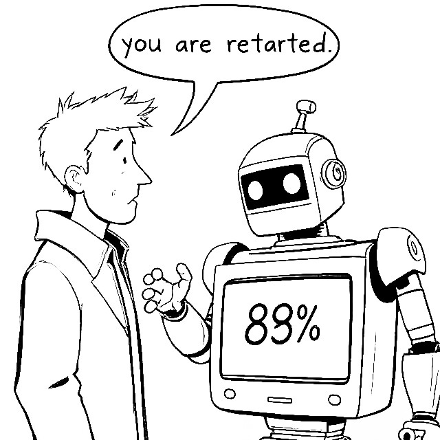

# Hate Speech Detection and Quantification

<p align="center">
  
</p>

This project provides a machine learning-based solution to detect and quantify hate speech in textual data using Natural Language Processing (NLP) techniques and a Random Forest classification model.

The system allows preprocessing of text data, transformation using a Bag-of-Words model, training on labeled datasets, and evaluating performance. Additionally, the model can take new textual input and estimate the likelihood of hate speech content after performing the necessary preprocessing steps.
This is a very basic version since the model has been trained only on a subset of the entire data contained in the HateSpeechDataset.csv file. 
And, future improvisations are underway, which are,
- Training the model on complete dataset for improved accuracy
- Exploring more advanced NLP techniques
- Investigating other ML models

---
## Project Overview

The primary goal of this project is to:
- Analyze paragraphs and predict whether they contain hate speech.
- Estimate the percentage likelihood that a given input constitutes hate speech.
- Use synthetic and real-world labeled data to train a supervised model using `RandomForestClassifier`.

---
## File Structure

- The script.py file contains all the functions that have been used to preprocess the data for further use.
- The notebook.ipynb file has the entire functioning of the project starting from importing the dataset, calling functions to preprocess, then training the model on the cleaned data; in the end, predicting for single inputs.
- The `Model` folder contains the saved model and the vectorizer to be used for future predictions.
- The Datasets folder contains all the datasets included in the model, since the file size is large, LFS tracking has been enabled.
- The requirements.txt file contains all the modules that are needed to make use of the repository.

---
## Dataset

This project utilizes two datasets:
- `HateSpeechDataset.csv`: A labeled dataset with text and corresponding hate speech annotations.
- `synthetic_hate_speech_dataset.csv`: A synthetic extension generated for enhanced training.

Each row contains a textual paragraph with its respective label indicating hate speech presence.

---
## Installation

Clone the repository and install required dependencies:

```bash
git clone https://github.com/JPS9380/Hate-Speech-Detector.git
cd Hate-Speech-Detector
pip install -r requirements.txt
```
---
## Usage
After installing, 
1. Navigate to the project directory
```bash
cd Hate-Speech-Detector
```
2. Start jupyter notebook (jupyter lab will also work)
```bash
jupyter notebook
```
3. Open "notebook.ipynb", create a new cell at the end and run the following snippet,
```bash
from script import *
from script import cv
import joblib
model = joblib.load('Model/model.joblib')
cv = joblib.load('Model/vectorizer.joblib')
inp = clean_input("_") #Enter your sentence in place of the underscore.

model.predict(inp)
```

---
### Note: 
- Make sure to download stopwords from the nltk module for the english language.
- In the script.py file, make sure to replace the 'text_column' and 'label_column' with actual column names from your csv.
- While reading the probability predictions for a single input be known that the value at zero index is the probability that the given input belongs to the first group(non-hate) and the value at the first index is the probability that it belongs to the second group(hate).